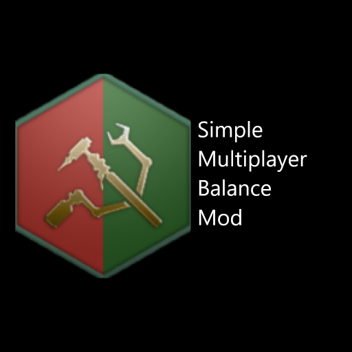

## Introduction
Welcome! This mod is simple and focuses only on nerfing or boosting existing game mechanics. No huge changes are ever considered. We want this mod to be easy to turn on and off.

The remainder of this document will go over the process used for deciding what and how to balance:

1. Why was this mod created?
2. What is the process used to balance mechanics?

You can refer to the:
 * [patch notes](patch_notes.md) to see the full balance list
 * [patch logs](patch_logs.md) to see recent updates and some explanations
 * [patch_notes_explanation](patch_notes_explanation.md) for more detailed explanations

## Why was this mod created?
This mod hopes to address the meta game balance issues in multiplayer with quick, easy and small tweaks so that people can enjoy the game more and worry less about about whether they are min-maxing correctly.

## What is the process used to balance mechanics?

What is balanced, what is not balanced and how changes are made will be done with a rough set of rules as indicated below:

1. Keep it Simple
2. Nerf overpowered mechanics
3. Boost underpowered mechanics
4. Do not change the meta

### Keep it Simple
The first objective of this mod is to KEEP IT SIMPLE and impact as little as possible to avoid breaking other aspects of the game. The reasons for doing this are the following:

1. We don't want to mess with the AI's logic
2. We want this mod to be EASY to maintain from version to version
3. We don't want the mod to crash people's games

Thus any decision to balance something will focus on doing it with the simplest way possible that touches the least amount of code.

### Nerf Overpowered mechanics
Very self-explanatory. We will nerf those mechanics that are universally considered S class (overpowered). Anything that is A or lower will not be nerfed. 

How do we decide what is S powered? This will be done after reviewing personal feedback from several players, youtube videos explaining exploits from established members of the community (such as Stefan Anon, Montu, Komrad Truck, ASPec etc...), chats on the Stellaris forums and so on forth.

### Boost Underpowered mechanics
Some mechanics are overpowered because others are RELATIVELY underpowered. Hence some of the clearly underpowered mechanics will be given boosts.

What is decided to be underpowered will be done in much of the same way as what is decided to be overpowered.

### Do not change the meta
This rule mostly falls in line with the other rules about tackling S, D and F powers, but it is worth reiterating. The mod should only weaken the meta, not change it. As such it is better to make small incremental changes rather than large sweeping boosts and penalties.